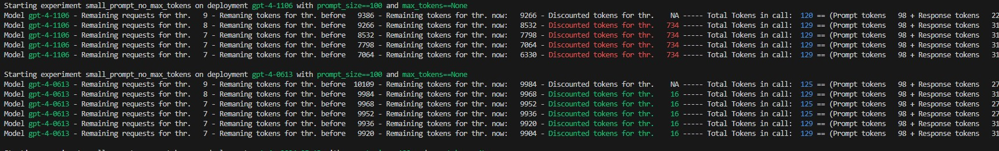

# Azure OpenAI Throttling tool

This tool can be used for measuring API throttling.
You can use the bash scripts for creating and listing Azure OpenAI deployments in your Azure Cognitive Service account of choice. For that edit `config.sh` with your desired values.

The needed script is `az_openai_throttling_experiment.py`.
It takes the following environment variables:

`
AZURE_OPENAI_API_KEY  = os.environ.get("AZURE_OPENAI_API_KEY")
AZURE_OPENAI_ENDPOINT = os.environ.get("AZURE_OPENAI_ENDPOINT")
`

Then, it will test any deployment name in the following array:

`
AZ_OAI_DEPLOYMENTS = [
    "gpt-4-1106",
    "gpt-4-0613",
    "gpt-4-vision-preview",
    "gpt-4-turbo-2024-04-09",
    "gpt-4o-2024-05-13",
    "gpt-35-turbo-0613",
    "gpt-35-turbo-1106",
    "gpt-35-turbo-16k-0613",
    "gpt-4-32k-0613"
]
`
Change it to whatever works for you

The tool will just send an arbitary number of tokens from Hamlet and ask the LLM to classify the novel and author. 

